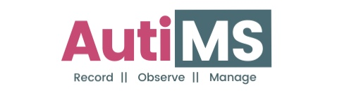

# AutiMS

## Intro

**AutiMS** is a management app for documenting reports of patients undergoing therapy as well as giving full access to these reports to parents and other authorized family members.

It's a "by registration/invite only" application that connects therapists of patients living with Autism directly with parents/guardians and other family members, to give room for proper communication.

Built as a Progressive Web App (PWA), you can simply add it to your phone's home screen like a native app, without having to download from the Play store / App Store (amongst other things).

### User Account Types

1. Therapist
2. Parent
3. Caregiver

### Features

1. Therapists can register patients, with a guardian's details. The guardian must have a parent account on the application.
2. Parents can add several Caregiver accounts for family members to also have access to patient's records. Caregivers are like mini-parents.
3. Therapists can add several monthly and session reports for each patient, all of which can be accessed by the guardian and any family member authorised with a caregiver account.
4. Therapists can also add an Activity List to include the daily tasks amd to-dos for each patient, this can be regularly updated.
5. Several therapists can register a patient with the same guardian details, all reports by the individual therapists will also be available and accessible.
6. Parents and Caregivers can create several Observation reports to be sent to the specified therapist.

### How To Use (For Therapists & Parents)

1. Visit the website
2. Sign up for a therapist/parent account
3. Start documenting! 

### How To Use (For Caregivers)

1. Receive a caregiver account invite via email from a Parent account on the app
2. Set new password
3. Start documenting!

### Test Account Details
Therapist: airahyusuff@gmail.com autims2020

Parent:  khairahscorner@gmail.com autims2020

Caregiver: contact@khairahscorner.com autims2020

### Improvements

Several other features are to be added to the app. 

### Does this Project sound interesting?

I'd appreciate contributors, do send me an email ar airahyusuff@gmail.com if you're interested in taking up this project with me and moving on to make it more feature-inclusive and reach more families who need it.

Thanks 🖤

